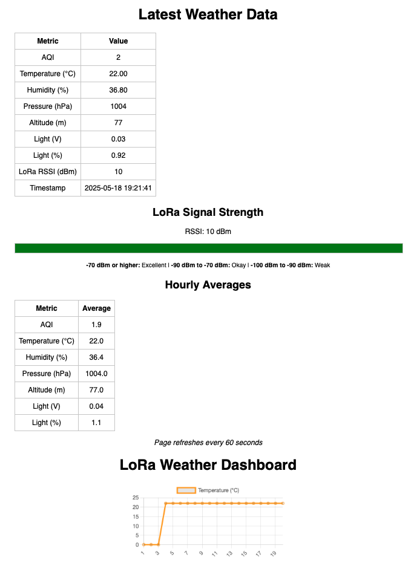

# LoRaWeatherStation
## Raspberry Pi Pico 2 based, automated solar-powered weather station and 'smart' home.

This repository contains code, STL cad files, notes, and pictures for a Remote weather station and 'smart' home that I designed.  This project operates on Raspberry Pi Pico 2s and uses RYLR993 lite LoRa modules for the communication method between the weather station and model house.  The use of these modules is pretty simple with the use of AT+ commands and initial range tests showed 1000+ feet in urban environment, and easily over 1 mile in a rural environment.   

## Repo 'map'
### Each system has Code and CAD subfolders for related content

- WeatherStation folder contains all code associated with the Weather Station.  WSMainSend.py is the finalized, tested and working code.  Other files are test programs.
- SmartHouse folder contains all code associated with the Smart House.  ModelComplete.py is the finalized, tested and working code.  Other files are test programs.
- LoRaTests folder contains test code for the RYLR993 lite lora modules.
- Documents contains pictures, notebook scans, and other documentation accumulated during this projects development.
- WebServer folder has code for the additional, SeeedStudio Xiao ESP32C6 based web server that hosts a simple stats page and graph.     

### Example of how the web server displays

### To be added:
- Commenting on test programs
- Additional project documentation
